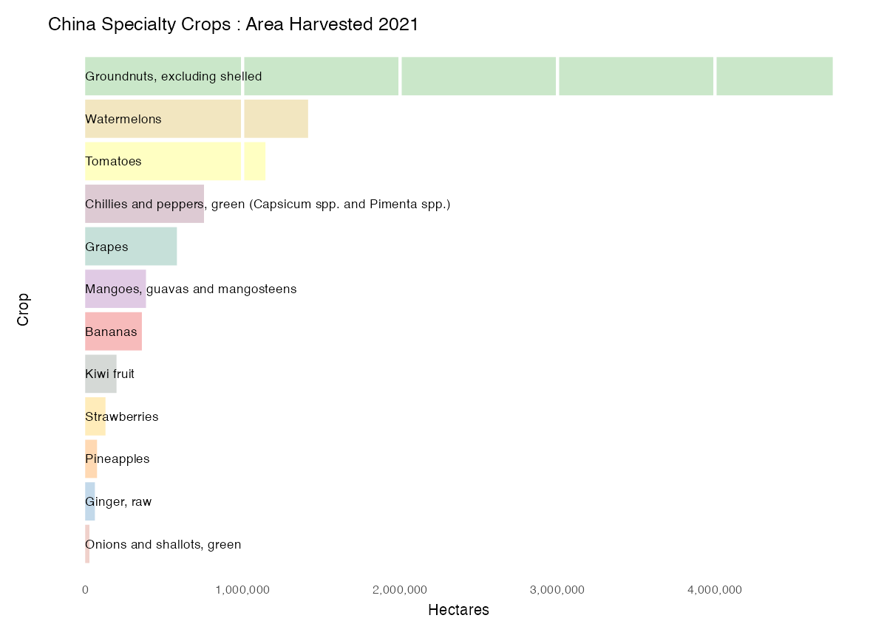

UN Food and Agriculture Organization Fertilizer and Crop Data
=============

Introduction
------------
I created these visualizations to help an international sales director convey a better understanding of crops and fertilizer to colleagues in a US-based company.

I broke down the data by selected geography, nutrients, and crops based on the sales director's interest. Some crops were currently targeted for sales efforts, others had been identified as potentially lucrative markets by the company's agronomists or by international distributors.

### Data source

Most of the files are available for download from the FAO: <http://www.fao.org/faostat/en/#data>. Original data is in CSV format.

Both the crops data and fertilizer data needed some cleaning, all of which I did in R.

I created two CSV settings file, based on conversations with the sales director:

- `items.csv`: categorize crops, create better labels, set data flags
- `countries.csv`: flag and group countries of interest

When I updated this project with newer data files recently, I noticed that the column order had changed and that certain keys (Item Code and Area Code) were inconsistent over time. e.g. the Area Code for Malaysia changed.

### ColorBrewer

I am a fan of [ColorBrewer](https://colorbrewer2.org/) and used it throughout this project, with the help of the `RColorBrewer` library.

### Novel (for me) techniques

This was my first attempt to use the ggsave() function to export a plot to disk, rather than manually export via RStudio's plot viewer.

Basic requirements
------------------
R/RStudio, ggplot and several other libraries:
- reshape
- tidyverse
- RColorBrewer
- scales
- ggrepel

Files in this repo
------------------
    README.md
    crops.R (visualizations by crop and geography)
    fert.R (visualizations by fertilizer/nutrient and geography)
    grep-product-csv.sh (shell script to grep out lines needed from bulk data download.)
    unfao-fert-crop.R (settings, load libraries)
    csv/
      countries.csv (see above)
      items.csv (see above)
      production_crops_expurgated.csv (Crop data grepped out of 487MB download)
      Inputs_FertilizersNutrient_E_All_Data_(Normalized).csv
      Inputs_FertilizersProduct_E_All_Data_(Normalized).csv

Useful links
------------------
International Fertilizer Industry Association (IFA) Database
<http://www.fertilizer.org>

United Nations Commodity Trade Statistics Database (COMTRADE)
<http://comtrade.un.org>

FAO &UNSD (2017) System of Environmental-Economic Accounting for Agriculture,Forestry and Fisheries: SEEA AFF. White cover version.
<https://seea.un.org/content/ag-for-fish>

UNSD (2017) Framework for the Development of Environment Statistics (FDES2013)
<https://unstats.un.org/unsd/envstats/fdes.cshtml>

Limitations
-----------
From the FAO documentation...

> Data in this FAOSTAT domain refer to calendar years. However, in some cases the data available correspond to fertilizer years. These cases are indicated in country notes in the “related documents” section in FAOSTAT.
> 
> Production of certain fertilizers may derive from the transformation of other fertilizer products. This can be considered ‘secondary production’. In the past, data related to secondary production was not reported in this Fertilizers by Product domain, in order to avoid double-counting when calculating the totals in nutrients. At the moment, however, data considered secondary production is being gradually allowed in this domain, to provide more complete data by product. Notwithstanding, the data identified as secondary production are not included in the aggregates of the Fertilizers by Nutrient domain, to avoid double-counting. The risk of double-counting remains only as long as there may be cases of secondary production that have not yet been identified as such.
> 
> A particular case is that of anhydrous ammonia and phosphate rock. In the Fertilizers by Nutrient domain these are considered fertilizer products only if used for direct application in agriculture; otherwise they are considered raw materials or intermediate products and are excluded from the calculation of totals in nutrients. Therefore, data on production and trade of anhydrous ammonia and phosphate rock are provided in this Fertilizers by Product domain, but only if used for direct application are they included in the Fertilizers by Nutrient domain. A revision is currently in progress to ensure consistency in the application of these criteria.
> 
> In summary, the addition of the data from this Fertilizers by Product domain, converted to nutrients, may differ from the totals provided in the Fertilizers by Nutrient domain. This may be because: i) data available by nutrient are often more complete than data available by product, ii) data available by nutrient may have been gap-filled, ii) data for anhydrous ammonia and phosphate rock may be excluded from the totals by nutrient, and iii) in the case of production data, some data by product may be considered secondary production.

Plots / Visualizations
----------------------

### Asia-Pacific Broadacre Crops (Hectares Harvested)

The company is interested in the total hectares planted of 4 specific broadacre crops. The more land planted... the more fertilizer needed, all other things being equal. This shows that maize (corn) and rice are by far the major crops in selected Asia-Pacific countries.

### China: Median area planted & production tonnage, 2017-2021, by crop

This required aggregating data for selected years and grouping the groups by various criteria (broadacre, tree nuts, special interest, currently marketed to). Each criteria was assigned a color. We can see that certain crops of interest have high potential. Tree nuts, not so much.

I had to apply log transformations to the scale to avoid all points being gathered in the lower left. Requires some explanation to unsophisticated audiences.

### China: Specialty Crops, area harvested

Specialty crops are a good application for the company's specialized fertilizers. This bar chart catches the eye... clearly marketing towards groundnuts (peanuts) will be the first thing to try.

### China: crops by area planted

China is a market with growth potential for the company. This simple bar chart shows that cereal crops dominate in terms of area planted. Not impressive to look at, but an important message.

### Global Nutrient Inputs to Agricultural Soils (Area)

This excludes fertilizers used on turf and non-agricultural applications. We can see that nitrogen dominates by tonnage. We can also see that Asia and the Americas use the lions share of all three main nutrients. Marketing to Europe is more expensive, more highly-regulated and lower volume.

### Global Nutrient Inputs by Region (Faceted Area Chart)

This shows the same data as the previous chart, but in a different way. I have faceted each region/content into its own area chart. It makes it easier to see that nutrient usage in Asia and Europe is dominated by Nitrogen. Phosphate and Potash make up a larger percentage of usage in the Americas.

### Global Nutrient Inputs by Region (Stacked Bar)

This is essentially the same data as the area chart above, with fewer years selected. I think the area chart conveys the information more clearly.

